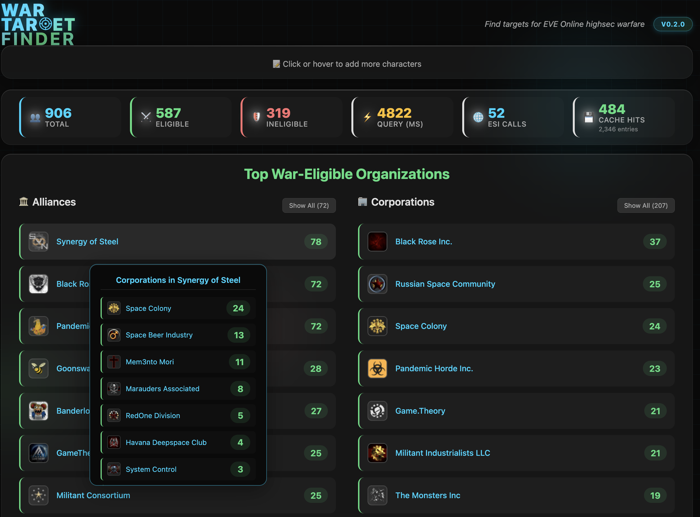

# EVE War Target Finder

A tool to identify war-eligible targets for EVE Online highsec warfare.



## 🎯 Features

### Core Functionality
- **Bulk Character Analysis**: Process thousands of character names simultaneously
- **War Eligibility Detection**: Instantly identify which characters can be targeted in highsec wars
- **Organization Summaries**: View top war-eligible corporation and alliance info at a glance
- **Real-time Progress**: Live updates during data processing with detailed statistics
- **Runs Locally**: All data travels directly between the ESI and your browser, so nobody can see who you're spying on
- **Data Caching**: Data is cached on your local machine to reduce ESI load and reduce load times

### User Experience
- **Modern UI**: Glass-morphism design with smooth animations and responsive layout
- **Dual View Modes**: Switch between grid and list views for different use cases
- **Progressive Loading**: Load more results as needed without overwhelming the interface
- **Mobile Responsive**: Works seamlessly across desktop, tablet, and mobile devices

## 🚀 Quick Start

### Online Version
Visit the live application: **[War Target Finder](https://moregh.github.io/)**

## 📋 How to Use

1. **Enter Character Names**: Paste character names in the text area, one per line
2. **Run Analysis**: Click "Check War Eligibility" or use `Ctrl+Enter`
3. **Review Results**: Characters are automatically sorted into eligible and ineligible categories
4. **Explore Organizations**: View summaries of war-eligible corporations and alliances
5. **Export Data**: Use browser tools to copy results or visit zKillboard links

### Input Format
```
Chribba
Suitonia
Bjorn Bee
```

### Supported Features
- ✅ Character name validation
- ✅ Duplicate detection and removal
- ✅ Batch processing of enormous data sets
- ✅ Error handling for invalid names
- ✅ Progress tracking with performance metrics

## 🏗️ Technical Architecture

### Frontend Stack
- **Vanilla JavaScript**: No frameworks, maximum performance
- **IndexedDB**: Client-side database for sophisticated caching
- **CSS Grid/Flexbox**: Modern responsive layouts

### ESI Integration
- **EVE Swagger Interface**: Official EVE Online API
- **Respectful Rate Limiting**: Chunked requests with delays
- **Error Handling**: Graceful degradation for API issues
- **Caching Strategy**: Intelligent cache management

### Performance Optimizations
- **Virtual Scrolling**: Handle thousands of results without performance degradation
- **Lazy Loading**: Images loaded on-demand as they enter viewport
- **Debounced Updates**: Smooth UI updates without excessive redraws
- **Memory Management**: Efficient cleanup of observers and event listeners

### Key Components

#### Caching Layer (`script.js`)
- IndexedDB initialization and management
- Automatic local caching and expiry
- Batch operations for optimal performance

#### ESI Integration
- Character name → ID resolution
- Character affiliation lookup
- Corporation/Alliance information retrieval

#### UI Management
- Virtual scrolling for large datasets
- Progressive loading and pagination
- Responsive design with mobile support

## 📊 Performance Metrics

The application displays real-time performance statistics:

- **Query Time**: Total processing time in milliseconds
- **ESI Calls**: Number of API requests made to EVE servers
- **Cache Hits**: Number of locally cached lookups
- **Cache Entries**: Total number of cached entries in IndexedDB

### Typical Performance
- **First Run**: ~2-5 seconds for 50 characters (full API calls)
- **Cached Run**: ~200-500ms for 50 characters (cached data)
- **Large Batches**: Scales linearly with respectful rate limiting

## 📄 License

This project is licensed under the AGPL License - see the [LICENSE](LICENSE) file for details.

## 🙏 Acknowledgments

- **CCP Games**: For providing the EVE Swagger Interface (ESI)

## 🔮 Roadmap

- [ ] **zKill Integration**: Pull character/corporation/alliance data from zKill for display within results
- [ ] **Expand Entries**: Allow users to paste in corporation and alliance names in addition to characters
- [ ] **Search & Filtering**: Search results by names or filter by alliance or corporation
- [ ] **Historical Data**: Track changes in war eligibility over time

---

**Disclaimer**: This application is not affiliated with or endorsed by CCP Games. EVE Online and all related characters, names, marks, and logos are intellectual property of CCP hf.

For support, feature requests, or bug reports, please [open an issue](https://github.com/moregh/moregh.github.io/issues) on GitHub.
