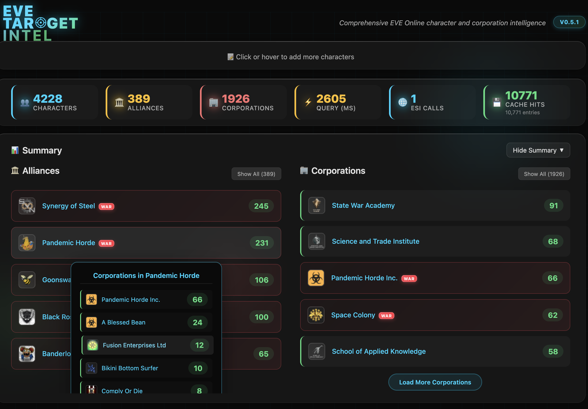
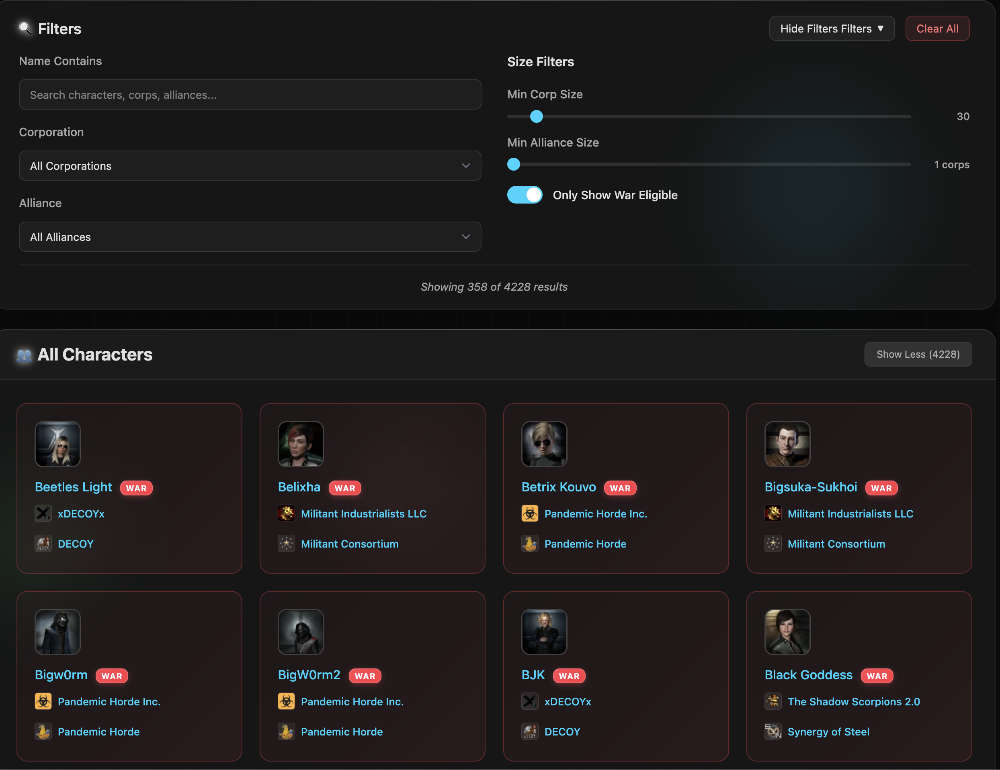
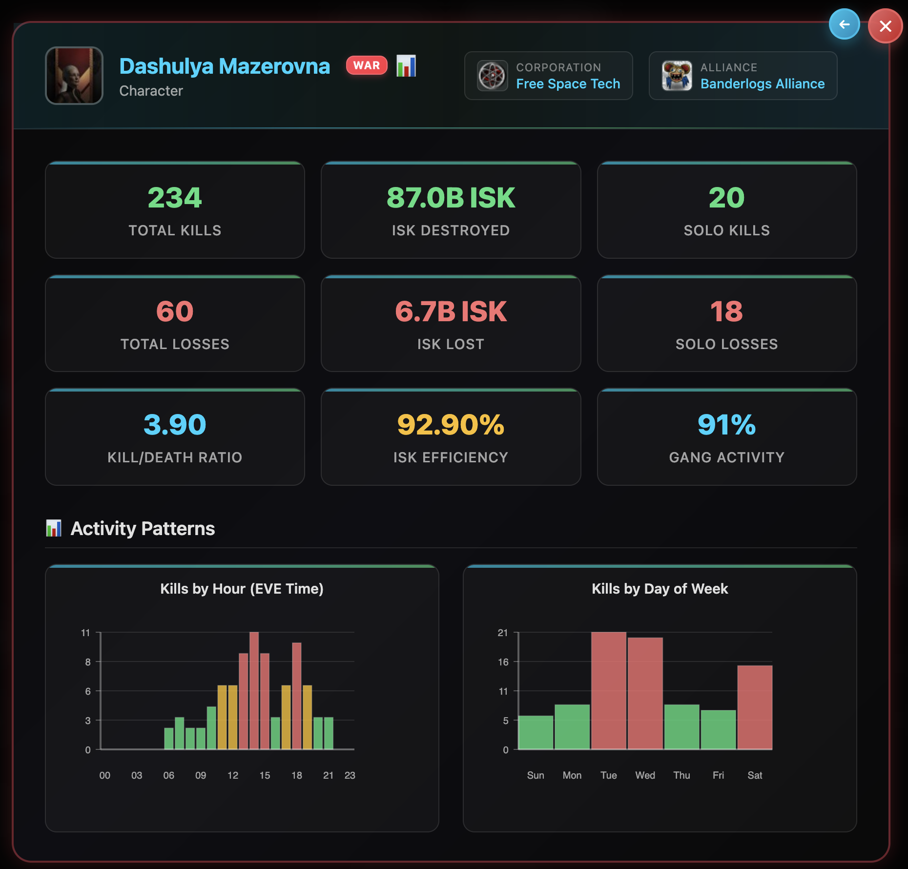
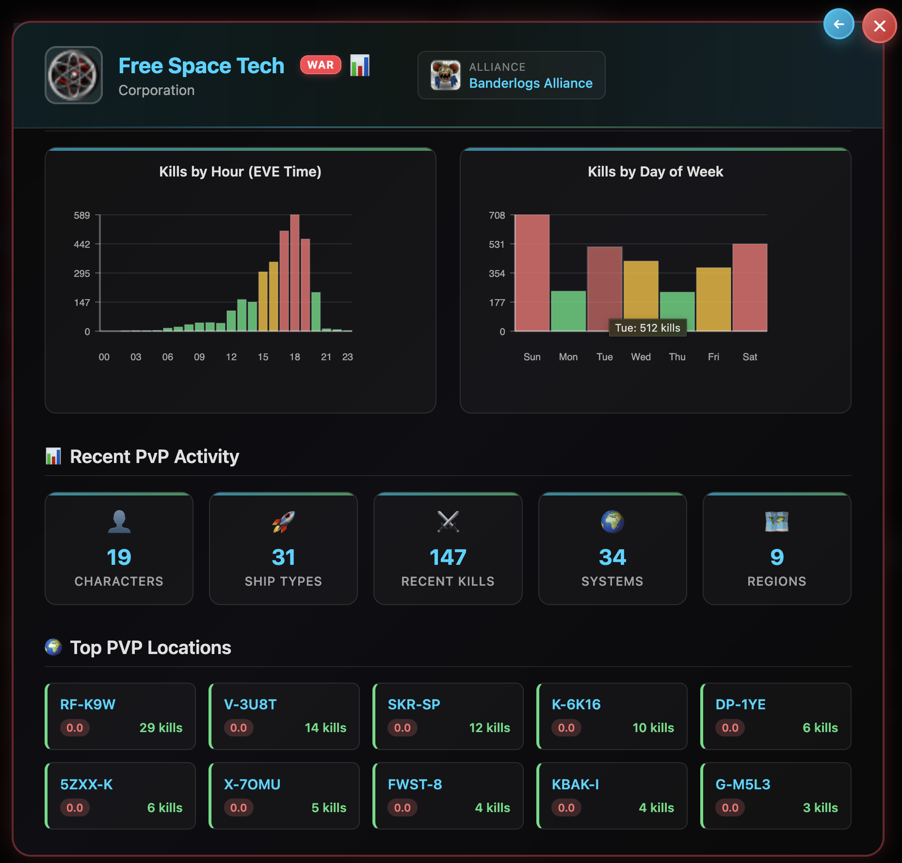

# EVE Target Intel

An intelligence tool for EVE Online character and corporation analysis.

### Results Summary ###


### Filtering ###


### Player Intel ###


### Corporation Intel ###


## 🎯 Features

### Core Functionality
- **Bulk Character Analysis**: Process thousands of character names simultaneously
- **Detailed Intelligence**: Get detailed character, corporation, and alliance information
- **War Eligibility Detection**: Instantly identify which entities can be targeted in highsec wars
- **Organization Summaries**: View top corporations and alliances with member counts
- **zKillboard Integration**: Access kill statistics and activity data for characters and organizations
- **Real-time Progress**: Live updates during data processing with detailed statistics
- **Runs Locally**: All data travels directly between ESI/zKillboard and your browser - complete privacy
- **Smart Caching**: Intelligent data caching reduces API calls and improves performance

### Advanced Filtering & Search
- **Multi-criteria Filtering**: Filter by war eligibility, corporation, alliance, organization size
- **Real-time Search**: Search across character, corporation, and alliance names
- **Size-based Filters**: Filter by minimum corporation or alliance size
- **Instant Results**: All filters apply in real-time with live result counts

### User Experience
- **Modern UI**: Glass-morphism design with smooth animations and responsive layout
- **Dual View Modes**: Switch between grid and list views for different use cases
- **Collapsible Sections**: Hide/show summary and filter sections for optimal screen usage
- **Progressive Loading**: Load more results as needed without overwhelming the interface
- **Mobile Responsive**: Works seamlessly across desktop, tablet, and mobile devices

## 🚀 Quick Start

### Online Version
Visit the live application: **[EVE Target Intel](https://moregh.github.io/)**

## 📋 How to Use

1. **Enter Character Names**: Paste character names in the text area, one per line
2. **Run Analysis**: Click "Analyze Characters" or use `Ctrl+Enter`
3. **Review Results**: View detailed character, corporation, and alliance information
4. **Apply Filters**: Use the filtering system to narrow down results by various criteria
5. **Explore Organizations**: View summaries of corporations and alliances with detailed statistics
6. **Access Kill Data**: Click on any character or organization to view zKillboard statistics

### Input Format
```
Chribba
Suitonia
Bjorn Bee
```

### Supported Features
- ✅ Character name validation and duplicate detection
- ✅ Batch processing of enormous data sets (thousands of characters)
- ✅ Advanced filtering and real-time search capabilities
- ✅ zKillboard integration for kill statistics and activity data
- ✅ War eligibility detection and organization analysis
- ✅ Error handling with graceful degradation
- ✅ Progress tracking with detailed performance metrics

## 🏗️ Technical Architecture

### Frontend Stack
- **Vanilla JavaScript**: No frameworks, maximum performance
- **IndexedDB**: Client-side database for sophisticated caching
- **CSS Grid/Flexbox**: Modern responsive layouts

### API Integration
- **EVE Swagger Interface (ESI)**: Official EVE Online API for character/corporation data
- **zKillboard API**: Real-time kill statistics and activity data
- **Respectful Rate Limiting**: Chunked requests with delays and retry logic
- **Error Handling**: Graceful degradation for API issues and timeouts
- **Smart Caching Strategy**: Intelligent cache management with automatic expiry

### Performance Optimizations
- **Virtual Scrolling**: Handle thousands of results without performance degradation
- **Lazy Loading**: Images loaded on-demand as they enter viewport
- **Debounced Updates**: Smooth UI updates without excessive redraws
- **Memory Management**: Efficient cleanup of observers and event listeners


## 📊 Performance Metrics

The application displays real-time performance statistics:

- **Query Time**: Total processing time in milliseconds
- **ESI Calls**: Number of API requests made to EVE servers
- **Cache Hits**: Number of locally cached lookups
- **Cache Entries**: Total number of cached entries in IndexedDB

### Typical Performance
- **First Run**: ~2-5 seconds for 50 characters (full API calls)
- **Cached Run**: ~200-500ms for 50 characters (cached data)
- **Large Batches**: Scales linearly with respectful rate limiting

## 📄 License

This project is licensed under the AGPL License - see the [LICENSE](LICENSE) file for details.

## 🙏 Acknowledgments

- **CCP Games**: For providing the EVE Swagger Interface (ESI)
- **zKillboard**: For providing comprehensive kill statistics and activity data

## 🔮 Roadmap

- [x] **zKillboard Integration**: Pull character/corporation/alliance data from zKillboard for display within results
- [x] **Advanced Filtering**: Multi-criteria filtering by war eligibility, corporation, alliance, and organization size
- [x] **Real-time Search**: Search results by character, corporation, and alliance names
- [ ] **Expand Input Types**: Allow users to paste in corporation and alliance names in addition to characters
- [ ] **Historical Data**: Track changes in war eligibility and organization membership over time
- [ ] **Export Capabilities**: Export filtered results to CSV or other formats
- [ ] **Saved Searches**: Save and recall frequently used filter combinations

---

**Disclaimer**: This application is not affiliated with or endorsed by CCP Games. EVE Online and all related characters, names, marks, and logos are intellectual property of CCP hf.

For support, feature requests, or bug reports, please [open an issue](https://github.com/moregh/moregh.github.io/issues) on GitHub.
